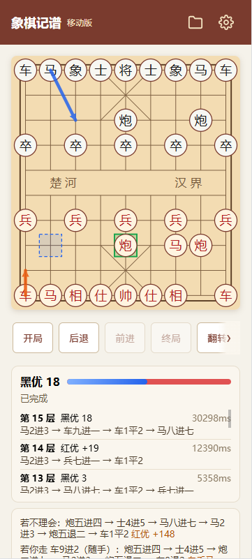
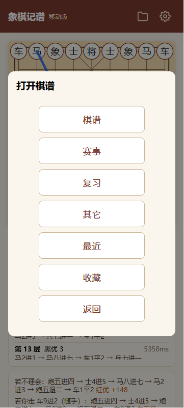
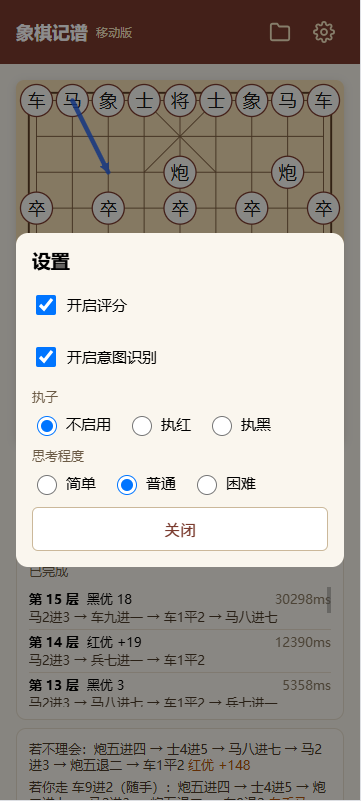
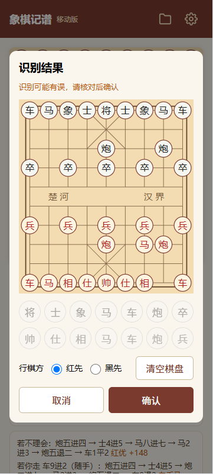

# 象棋记谱 Web

单用户、本地部署的中国象棋棋谱管理、背谱复习与 AI 对弈工具：棋谱录入与打谱、SM-2 间隔重复背谱、逐层加深的 AI 局面分析、对手意图推演、人人 / 人机对弈、变着树、摆子编辑与摄像头扫描识别。

**技术栈**：Flask + SQLite ｜ 纯 Python 引擎（Cython / numba 双后端、Lazy SMP 并行搜索）｜ Vue 3 + Vite + Pinia（移动优先）｜ ONNX 棋盘识别

## 界面预览

| 打谱与 AI 分析 | 棋谱库菜单 | 设置面板 | 扫描识别局面 |
| :---: | :---: | :---: | :---: |
|  |  |  |  |

## 功能特性

- **棋谱管理**：文本（中文记谱 / ICCS 坐标）、PGN 导入、棋盘摆子三种录入方式；分类与关键字筛选，掌握度与下次复习日期一目了然。
- **打谱回放**：逐步回放、点击着法列表跳转、切换视角，支持上一盘 / 下一盘连续浏览。
- **背谱默写与间隔重复**：走对才前进，走错标红并计错，支持「看答案」与选择默写阵营；SM-2 调度自动生成今日复习队列。
- **AI 局面分析**：迭代加深实时评分，优势条 + 棋盘箭头标注双方推演，打谱 / 对弈均可开启。
- **对手意图推演**：走子后推演对手底线威胁与诱饵陷阱分支。
- **人人对弈**：同屏双人轮流走子，支持翻转棋盘、悔棋、从任意局面续下，对局可保存入库。
- **人机对战**：引擎执红或执黑，简单 / 普通 / 困难三档难度，保留实时分析与意图面板。
- **变着树**：同一局面跨棋谱汇聚，列出全部变着分支并可一键跳转。
- **局面编辑与扫描**：手动摆子，或拍摄屏幕 / 相册截图由 ONNX 模型识别局面，经规则校验后直接开局。
- **规则引擎**：蹩马腿、塞象眼、炮翻山、将帅照面、将死 / 困毙等完整合法性判定，单一真相源在后端。

## 快速开始

```bash
# 1. 后端依赖 + Cython 引擎扩展（未构建时自动回退 numba）
cd backend
python3 -m venv .venv
.venv/bin/pip install -r requirements.txt
.venv/bin/python setup.py build_ext --inplace

# 2. 构建前端（产物 frontend/dist 由后端托管）
cd ../frontend && npm install && npm run build

# 3. 启动（http://localhost:4098）
cd ../backend && .venv/bin/python app.py
```

环境要求：Python 3.11+、Node.js 18+，首次启动自动建库（SQLite）。

- 可选：棋盘识别模型约 42MB，执行 `.venv/bin/python scripts/download_models.py` 下载后启用「扫描局面」。
- 可选：设置 `AUTH_PASSWORD` 启用单用户密码登录；多 worker 部署需同时设置 `SECRET_KEY`。完整配置样例见 `.env.example`。

## 测试

```bash
cd backend && .venv/bin/python -m pytest    # 后端
cd frontend && npx vitest run               # 前端
```

## 部署要点

- 生产推荐 gunicorn 多 worker：`ENGINE_BACKEND=cython .venv/bin/gunicorn -w 2 -b 0.0.0.0:4098 "app:create_app()"`。
- 默认监听 `0.0.0.0:4098`，同一局域网手机可直接访问 `http://<电脑IP>:4098`；仅本机可设 `HOST=127.0.0.1`，端口可设 `PORT`。

## 项目结构

```
chess/
├── backend/      # Flask API、纯 Python 规则引擎、AI 引擎（Cython / numba）、ONNX 棋盘识别、SM-2 调度
├── frontend/     # Vue 3 + Vite + Pinia 移动优先界面（自绘 SVG 棋盘）
├── docs/plans/   # 设计文档与实现计划
└── data/         # 示例棋谱数据
```

各功能的设计与实现细节见 `docs/plans/`。
